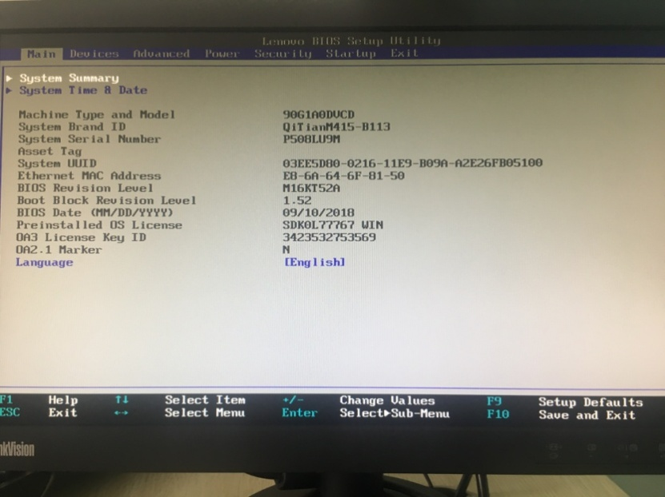

# OS基本概念与CentOS安装

**《深入操作系统》**

在浩如烟海的计算机科学的学科体系中，操作系统是一门核心课程，负责研究如何管理硬件资源（如磁盘、内存、CPU）以及如何为应用程序和用户提供抽象和服务。

1. 主板固件类型
    1. BIOS

BIOS（Basic Input Output System）：基本输入输出系统，加载在计算机硬件系统上最基本的软件代码。BIOS是比操作系统（OS）更底层的运行程序，用来设置硬件，主要功能是上电、自检、CPU/内存初始化、检测输入输出设备以及可启动设备并最终引导操作系统启动。BIOS中硬件配置信息和用户设定的参数信息存储在一块可读写的CMOS（互补金属氧化物半导体）芯片中，主板上有一块电池为CMOS提供电源，所以即使计算机完全断电CMOS中存储的信息也不会丢失。有时人们会把CMOS和BIOS混称，其实他俩是相互关联但不同的东西。

进入BIOS根据计算机品牌不同一般在计算机启动后按下F2、Del等按键进入BIOS程序设置界面。

图 1-1 传统的BIOS界面

BIOS这种固件接口规范最早由IBM在1981年提出，时间久远存在以下的限制：

- BIOS使用MBR分区表，支持的最大硬盘容量为2TB
- 启动速度较慢，串行硬件初始化方式
- 图形化支持不足
- 功能固定，扩展性差
- 安全性不足
    1. UEFI

UEFI（Unified Extensible Firmware Interface）是BIOS的一种升级替代方案，旨在应用系统程序交互性和解决BIOS限制。2013年之后生产的计算机基本都集成UEFI固件，但只具备UEFI基本功能，其设置界面和BIOS设置界面集成。现在只有中高端型号有完整的人性化的UEFI操作界面，网络功能丰富，甚至可以在没有安装任何操作系统的计算机上使用UEFI浏览网页。目前UEFI主要功能特点如下：

- 支持超过2TB的硬盘引导操作系统
- UEFI支持直接从文件系统中读取文件。UEFI支持的文件系统有FAT16与FAT32。
- UEFI固件缩短了操作系统启动和休眠状态恢复的时间。
- UEFI只有在使用GPT分区表的硬盘才能成功安装Windows10操作系统。
- UEFI不用像BIOS一样读取硬盘第一个扇区中的引导代码来启动操作系统，而是通过运行efi文件来引导启动操作系统。（efi文件是一种可以在UEFI环境执行的程序文件）
    1. BIOS与UEFI比较

表1-1 BIOS与UEFI的比较

| **特性** | **BIOS** | **UEFI** |
| --- | --- | --- |
| **启动速度** | 较慢 | 更快 |
| **硬盘支持** | 最大支持2TB | 支持大于2TB |
| **界面** | 文本界面，键盘操作 | 图形界面，可以鼠标操作 |
| **安全性** | 无安全启动机制 | 支持安全启动 |
| **扩展性** | 固定，难以升级 | 模块化设计，易于扩展 |
| **网络支持** | 基本PXE支持 | 支持更多网络功能 |
| **支持的硬盘分区** | MBR | MBR/GPT |
1. 操作系统基本内容

学习操作系统主要学习操作系统的进程管理，内存管理，磁盘管理，文件系统，输出输出管理，并发控制等。

1. 磁盘管理基本内容

磁盘管理是操作系统课程中的一个重要模块，简单列举下磁盘管理中的几个内容：

1. 存储管理
- 文件系统：如何在存储设备上组织和管理文件数据，包括文件的存储结构、访问权限和元数据管理。
    
    例如：如何设计文件目录树结构；文件系统种类（EXT4、NTFS 等）的实现原理。
    
- 磁盘分区：如何通过分区表（MBR、GPT）来划分磁盘空间。标准分区和逻辑卷管理的特点与用途。
- 数据存储：数据存储在磁盘上的方式（连续分配、链表分配、索引分配等）。
    1. 磁盘调度

主要是操作系统如何优化磁盘访问速度，常见磁盘调度算法：FCFS、SSTF、SCAN、C-SCAN 等。

以及如何减少磁盘的寻道时间和旋转延迟。

1. 虚拟内存与交换分区
- Swap 分区的作用，虚拟内存的概念：当物理内存不足时，利用磁盘空间扩展内存。
- 以及分页与分段机制：涉及虚拟内存的实现方法。
    1. 存储设备管理
- 块设备与字符设备：磁盘作为块设备的特点。块设备的缓冲区管理（缓冲区高速缓存）。
- 设备驱动：磁盘驱动程序的工作原理。操作系统如何与存储硬件交互。
    1. 数据冗余与可靠性
- RAID：如何通过冗余提升磁盘的可靠性。各种 RAID 级别的优缺点和适用场景。
- 快照与备份：如何实现磁盘的快照。操作系统对快照功能的支持（如 LVM 快照、文件系统快照）。
    1. 挂载与设备管理
- 挂载机制：文件系统挂载点的作用与实现。操作系统如何动态挂载和卸载存储设备。
- 设备管理：如何管理动态添加的存储设备（如 USB 驱动器）。
    1. 数据一致性与恢复
- 日志文件系统：文件系统如何通过日志机制保证数据一致性。
- 磁盘检查与修复：文件系统错误的检测与修复（如 fsck 和 chkdsk）。
- 坏块管理：磁盘坏块的检测与处理。
1. 磁盘管理
    1. 磁盘分区表类型

磁盘分区是存储管理的主要内容，定义了硬盘分区的物理限制和布局，常见的**磁盘分区表**的类型主要分为MBR和GPT两类，它们决定磁盘的基础架构。

1. MBR分区

MBR（Master Boot Record）主引导扇区（主引导记录），用于记录硬盘信息以及硬盘分区表等重要数据信息，如果MBR遭到破坏，硬盘上的基本数据结构信息将会丢失硬盘数据将无法读取。

1. MBR数据结构

整个MBR只占用磁盘的一个扇区（Sector）而且是磁盘的第一个扇区,通常硬盘扇区的大小为512字节（目前为4K），MBR分区表的数据结构如下图所示：

图2-1 MBR分区表数据结构

MBR由三部分组成即主引导代码（Bootloader）、硬盘分区表（Partition table）、结束标志位。

- 主引导代码的主要作用是引导操作系统。
- 硬盘分区表的64 byte空间分为4个16 byte子空间，也就是说采用MBR分区格式的磁盘最多只能有4个主分区或者3个主分区和1个扩展分区（扩展分区最多只能有1个）。
    
    思考：采用MBR格式的磁盘在Windows上是不是只能分C/D/E/F四个磁盘？
    

由于可以在扩展分区内创建任意多个逻辑分区（Windows最多支持128个逻辑分区），如果是创建4个主分区，假设磁盘有400个扇区，那么在硬盘分区表中分别规定了每个磁盘分区的起始位置，其中顺带提一下磁盘中扇区的位置寻址方式，传统的CHS和现在的LBA。LBA（Logical Block Addressing，逻辑块寻址）是一种硬盘数据寻址方式，用于替代传统的CHS（Cylinder-Head-Sector，柱面-磁头-扇区）寻址方法。它将硬盘的存储空间线性化，使得数据访问更加简单高效。

下图2-2所示，假设磁盘有400个扇区，在第1个扇区上存储的MBR分区表中存储了四个硬盘的分区信息。

图2-2 MBR分区表存储四个主分区示意图

下图2-3所示，MBR分区表中存储了一个主分区和一个扩展分区的信息。

图2-3 MBR分区表存储一个主分一个扩展分区的示意图

1. GPT分区

GPT（GUID Partition Table）中文名称为全局唯一标识分区表，用来替代MBR分区表并配合UEFI启动使用。

1. GPT数据结构

GPT数据结构图中的LBA是磁盘的基本存储单元扇区，LBA 0就是磁盘的第一个扇区的意思。GPT分区由三部分组成即保护性MBR（Protective MBR）、主GPT表头（Primary GPT Header）、主分区条目数组（Partition Entries）、用户数据（User Data）、备份分区条目数组（Backup Partition Entries）、备份GPT表头（Backup GPT Header）。

图2-4 GPT分区表数据结构

- 保护性MBR（Protective MBR）：位置在磁盘的第一个扇区（LBA 0），作用是避免旧的MBR工具误将GPT磁盘识别为未分区磁盘。保护性MBR的数据结构是标准的MBR结构，包含一个假的分区条目覆盖整个磁盘，不过启动代码部分通常填充为零。
- 主GPT表头（Primary GPT Header）：位置在磁盘的第二个扇区（LBA 1），定义GPT的全局元数据。
- 主分区条目数组（Partition Entries）：紧跟在主GPT表头后，从LBA 2开始，描述每个分区的详细信息，包括分区位置、大小和类型。这也是所谓的硬盘分区表，与MBR最多4个相比GPT最多支持128个分区。
- 用户数据（User Data）:用于存储操作系统、文件系统或用户数据的用户分区的实际数据区域。
- 备份分区（Backup Partition Entries）：备份分区条目数据，位于磁盘的最后的扇区上，用于提供分区的冗余备份，在主分区条目数据损坏时恢复。
- 备份GPT表头（Backup GPT Header）：位于磁盘的最后一个扇区，是主GPT表头的冗余备份。
    1. 存储管理类型

当给一台机器准备安装操作系统前，首先要做的就是建立硬盘的磁盘分区类型（MBR或GPT），在完成这一步后，需要对硬盘分区进行管理。存储管理类型主要分为以下两种类型:

1. 标准分区

在分区表上直接创建固定的分区，每个分区代表一个存储区域。标准分区灵活性较低，一旦创建后，扩展或调整大小较复杂。

1. LVM

LVM是一种逻辑存储管理技术，可以在分区上创建物理卷（PV），再通过卷组（VG）和逻辑卷（LV）对存储资源进行灵活分配。LVM可以提供动态调整大小、快照等高级功能。

1. 分区表与管理类型的关系

在磁盘管理中选择何种分区表（MBR和GPT）以及何种的磁盘管理类型（标准分区和LVM），通过排列组合可知有4中方式：

1. MBR与标准分区

MBR的设计主要是与标准分区配合工作，因为它的分区结构简单，直接定义了主分区和扩展分区。

1. GPT与标准分区

GPT同样可以与标准分区一起使用，但提供了更大的灵活性，如更大的分区容量和数量。

1. MBR/GPT与LVM

LVM可以使用在MBR或GPT的分区上。例如：在MBR或GPT表上创建一个大分区（或多个分区），然后将这些分区作为LVM的物理卷（PV）。LVM 不直接依赖分区表的类型，但GPT更适合LVM，因为GPT支持更大的分区容量。

1. 磁盘分区管理最佳实践
- 如果磁盘需要简单的分区，不需要动态调整大小，则使用标准分区（MBR或GPT均可）。
- 如果需要灵活的存储管理，例如磁盘快照、动态扩展分区，推荐使用 LVM，底层分区表类型通常选择 GPT（尤其是大容量磁盘）。
- LVM 可用在MBR或GPT分区上，但GPT更适合现代大容量磁盘和复杂的存储需求。
1. Linux安装
    1. Linux分区方案

Linux下磁盘分区类型主要有**标准分区**和**LVM分区**等分区类型，其中标准分区方案适合磁盘较小或者分区需求较为固定的场景，优点是操作简单，性能开销低。LVM分区适用于对磁盘分区灵活的场景，支持动态调整分区的大小，便于扩展。下面基于Vmware（2G内存/40G的磁盘）环境安装CentOS，进行几种分区方案的创建。

1. 基于标准分区的方案

方案1：基本分区方案，标准分区格式，适用于普通用途的单系统，例如开发环境或桌面使用。

表3-1 基本分区（单系统，40GB磁盘）

| **分区** | **大小** | **文件系统** | **功能说明** |
| --- | --- | --- | --- |
| / | 15G | ext4/xfs | 根分区，存放系统文件和软件 |
| /boot | 1G | ext4 | 存放引导程序和内核 |
| swap | 4G | swap | 虚拟内存 |
| /home | 20G | ext4/xfs | 用户目录，存放个人数据 |

方案2：高级分区，标准分区格式，适用于小型服务器，考虑分离日志和临时目录。

表3-2 基本分区（服务器系统，40GB磁盘）

| **分区** | **大小** | **文件系统** | **功能说明** |
| --- | --- | --- | --- |
| / | 10G | ext4/xfs | 根分区，存放系统文件和软件 |
| /boot | 1G | ext4 | 存放引导程序和内核 |
| swap | 4G | swap | 虚拟内存 |
| /home | 10G | ext4/xfs | 用户目录，存放个人数据 |
| /var | 10G | ext4/xfs | 存放日志和动态数据 |
| /tmp | 5G | ext4/xfs | 临时文件 |
1. LVM分区方案

方案1：采用LVM（Logical Volume Manager）灵活的分区管理方式，适用于服务器。下面方案中我们有意留出5G空间留给以后要增加的新的逻辑卷或扩展现有的逻辑卷。

表3-3 LVM分区（服务器系统，40GB磁盘）

| **分区** | **分区类型** | **大小** | **文件系统** | **功能说明** |
| --- | --- | --- | --- | --- |
| /boot | 标准分区 | 1G | ext4 | 存放引导程序和内核 |
| swap | LVM逻辑卷 | 4G | swap | 虚拟内存 |
| / | LVM逻辑卷 | 15G | ext4/xfs | 根分区，存放系统文件和软件 |
| /home | LVM逻辑卷 | 15G | ext4/xfs | 用户目录，存放个人数据 |
| 剩余空间 | VG空闲空间 | 5G |  | 用于动态扩展逻辑卷 |
1. CentOS 7安装

以下示例是在VMware中安装CentOS 7，内存2G硬盘40G

1. 选择安装CentOS 7

1. 选择语言

1. **配置系统时区与时间**

1. 配置选择需要安装的软件

如果是只有命令提示行的界面就选择最小安装，Centos提供丰富的OS功能可以自定义安装。

1. 配置安装磁盘分区

选择自定义配置分区

1. 磁盘分区

下面以4.1.2中的LVM磁盘分区方案为例，根据LVM灵活的分区方案，首先挂载LVM中的磁盘

创建一个VM逻辑卷组，创建一个VG，总大小35G也就是剩余空间还有5G，可以将来扩展VG或者创建新的逻辑卷组。

1. 关闭kdump

1. 配置网络与主机名

勾选“可用时自动链接到这个网络”：

根据实际环境配置IPV4地址与DNS地址，并点击“保存”

检查主机名设置，IP设置，网卡连接开关，确认无误后点击“完成”

1. 操作系统安装

1. 配置ROOT用户密码

1. 完成安装，重启主机

